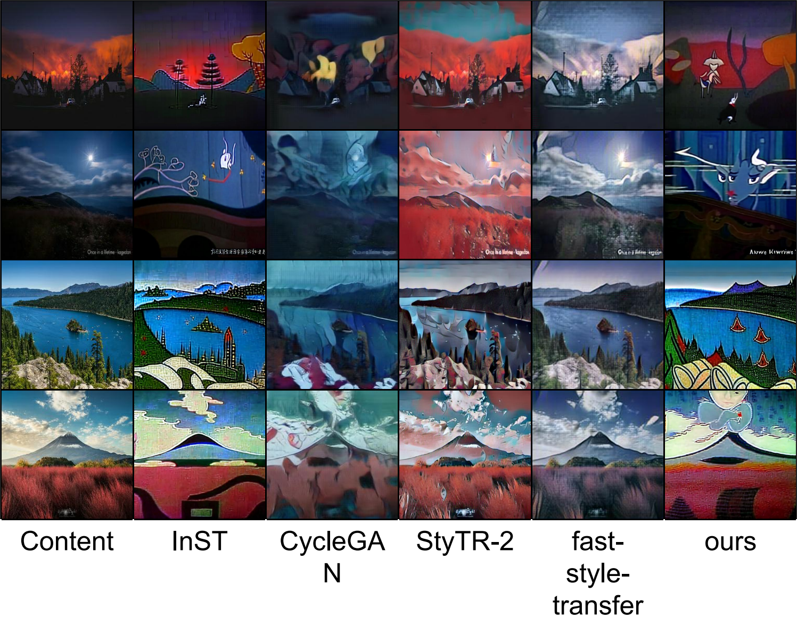
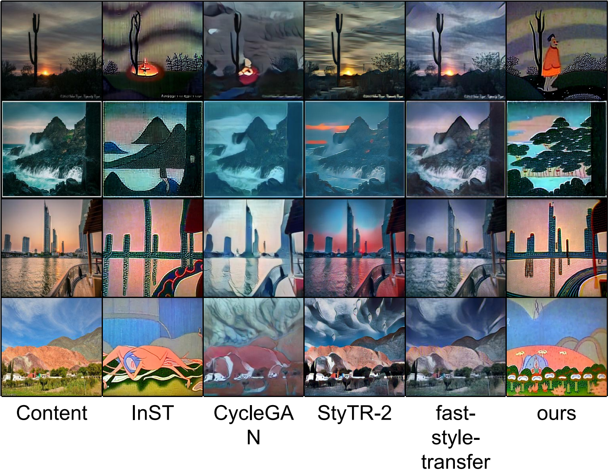

<div id="top"></div>
## SVD-InST

Final Project for AI3603-SJTU




For details see the Report.

<p align="right">(<a href="#top">back to top</a>)</p>

## Getting Started

### Prerequisites

For packages, see environment.yaml.

  ```sh
  conda env create -f environment.yaml
  conda activate ldm
  ```

<p align="right">(<a href="#top">back to top</a>)</p>

### Installation

   Clone the repo
   ```sh
   git clone https://github.com/dajiaohuang/SVD-InST.git
   ```

<p align="right">(<a href="#top">back to top</a>)</p>

### Train

   Train SVD-InST:
   ```sh
   python main.py --base configs/stable-diffusion/v1-finetune-svdiff.yaml
               -t 
               --actual_resume ./models/sd/sd-v1-4.ckpt
               -n <run_name> 
               --gpus 0, 
               --data_root /path/to/directory/with/images
   ```

   See `configs/stable-diffusion/v1-finetune.yaml` for more options

   Download the pretrained [Stable Diffusion Model](https://huggingface.co/CompVis/stable-diffusion-v-1-4-original/resolve/main/sd-v1-4.ckpt) and save it at ./models/sd/sd-v1-4.ckpt.

<p align="right">(<a href="#top">back to top</a>)</p>

### Test

   To generate new images, run svdInST1.py

```sh
python svdInST1.py /path/to/directory/with/test/content/images
```


<p align="right">(<a href="#top">back to top</a>)</p>
