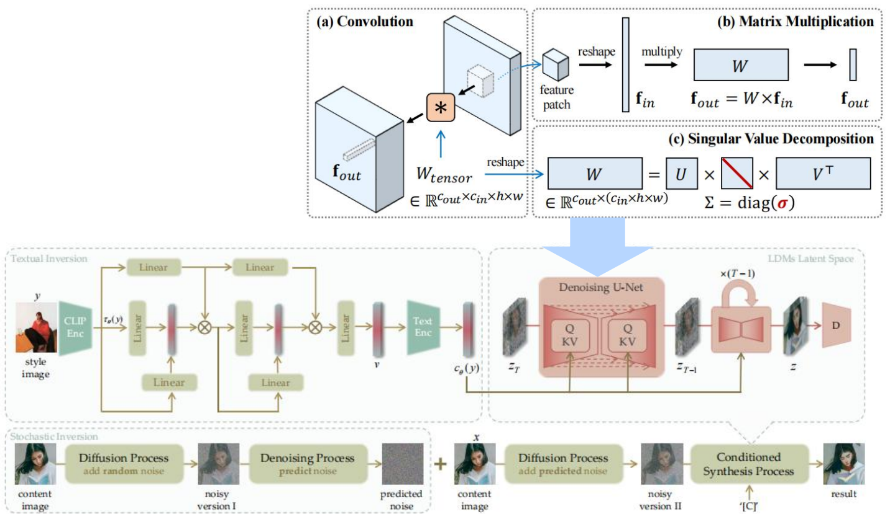
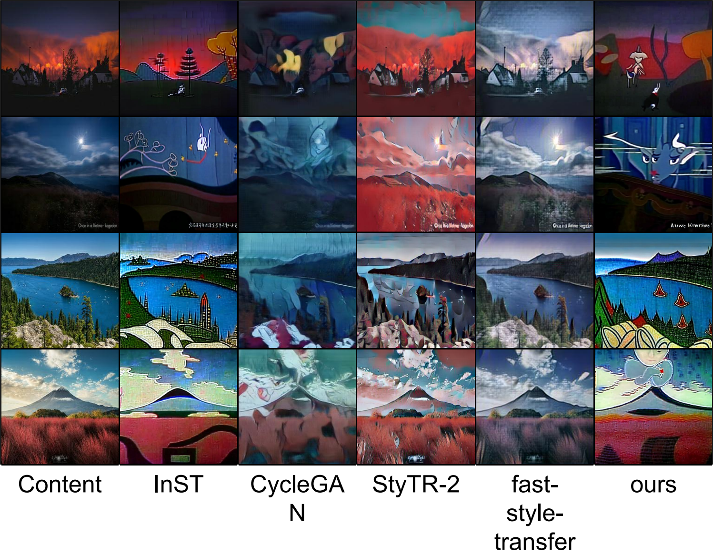
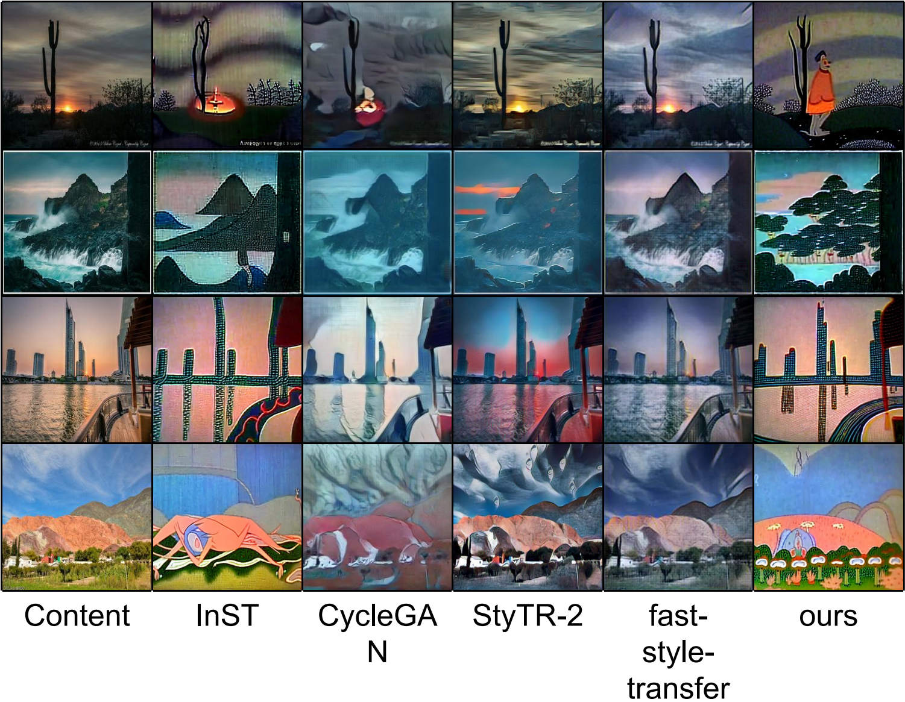

# SVD-InST

SVD-InST is a style transfer project built on top of Stable Diffusion. The method combines the image-conditioned personalization idea from InST with the singular-value fine-tuning strategy of SVDiff, and was developed as the final project for AI3603 at Shanghai Jiao Tong University.

## Authors

- Wu Shuwen - 521030910087 - mike0510@sjtu.edu.cn
- Su Zhan - 521030910112 - ililaoban@sjtu.edu.cn
- Yun Jiasheng - 521030910093 - yjs180303@sjtu.edu.cn



Additional sample results:




For the original project report and presentation material, see `17_苏展_吴舒文_运嘉盛.pdf` and `Report.pdf`.

## Abstract

We proposed SVD-InST, a model for image-to-image translation with generative models. The target task is to translate realistic photo images into mural-style paintings using the provided dataset. Our approach combines textual inversion for style alignment and singular-value fine-tuning for compact adaptation of Stable Diffusion. The design keeps the pretrained generative prior of Stable Diffusion while specializing the model to a single artistic transfer task.

## Task

This project targets **Problem-4: image-to-image translation with generative models**, where the input domain is realistic photographs and the target domain is **Nine-Colored Mural style** artwork.

The repository contains:

- training code for the SVD-InST variant of Stable Diffusion
- inference scripts for generating stylized images from content images
- configuration files for finetuning and inference
- example figures used in the project report

## Method summary

According to the report, SVD-InST combines two ideas:

1. **InST-style conditioning**: learn a placeholder token and image-aware embedding so that the target artistic style can be represented in the Stable Diffusion conditioning space.
2. **SVDiff-style fine-tuning**: decompose pretrained weights with SVD and optimize only singular-value updates instead of fully fine-tuning the whole diffusion model.

In this repository, that design is reflected by:

- `ldm.modules.embedding_manager.EmbeddingManager`, which learns the style-related embedding used with the placeholder token `*`
- `SVDmodel.py`, which defines SVD-based layers such as `SVDConv2d`, `SVDLinear`, `SVDEmbedding`, and normalization layers with trainable spectral shifts
- `configs/v1-finetune-svdiff.yaml`, which switches the UNet to the SVD-based implementation for fine-tuning

The overall goal is to preserve the strong generation prior of Stable Diffusion while improving style faithfulness and keeping content structure coherent.

## Method details

### Textual inversion for style alignment

Stable Diffusion uses CLIP text embeddings as conditioning. In SVD-InST, the target mural style is aligned with a special placeholder symbol, implemented as a learnable embedding vector. The report describes this as creating a "new word" for the style domain.

The implementation follows the InST idea of image-aware conditioning:

- the style image is encoded by a CLIP image encoder
- multi-layer attention extracts key style information
- the learned embedding is optimized so the diffusion model can generate images consistent with that style

### Singular-value fine-tuning

For a pretrained weight matrix `W`, the report formulates the update as:

```text
W = U Sigma V^T
W_delta = U Sigma_delta V^T
Sigma_delta = diag(ReLU(sigma + delta))
```

Only the singular values are updated during training, while `U` and `V^T` remain frozen. In code, this behavior is implemented in `SVDmodel.py`, where each wrapped layer stores a trainable `delta` and reconstructs the updated weight at forward time.

### Optimization view

The report separates the optimization into two parts:

- **textual embedding optimization** for the learned style token
- **spectral shift optimization** for the singular values of the latent diffusion model

This makes the model a hybrid of personalization-style conditioning and parameter-efficient diffusion fine-tuning.

## Related work

The report positions SVD-InST against several families of methods:

- **Diffusion models**: DDPM, Latent Diffusion Models, Stable Diffusion
- **Stable Diffusion fine-tuning methods**: DreamBooth, Textual Inversion, Hyper-Networks, LoRA, SVDiff
- **Style transfer baselines**: CycleGAN, StarGAN, BalaGAN, StyTR-2, InST, ArtFusion

Among these, the closest inspirations are:

- **InST** for inversion-based style transfer with diffusion models
- **SVDiff** for compact fine-tuning in the singular-value space

## Experimental results

The report compares SVD-InST against several style transfer baselines, including InST, CycleGAN, StyTR-2, and fast-style-transfer.


Reported quantitative results from the project report:

| Model | FID | LPIPS |
| --- | ---: | ---: |
| InST | 127.5 | 0.53 |
| CycleGAN | 178.3 | - |
| StyTR-2 | 171.3 | - |
| fast-style-transfer | 172.7 | - |
| SVD-InST (ours) | **125.1** | **0.54** |

Lower FID indicates better distributional quality. The report shows that SVD-InST achieves the best FID among the compared methods while keeping LPIPS at a level similar to or slightly better than InST.

Additional observations reported by the team:

- CycleGAN performs strongly for unpaired domain transfer, but does not naturally provide diverse outputs for the same input.
- StarGAN was found to overfit more easily on this dataset.
- StyTR-2 produced visually reasonable results, but a simplified version of the architecture was less robust than the full model.
- BalaGAN was considered less suitable for this task because it is more oriented toward attribute manipulation than pure artistic style transfer.

## Reported training and evaluation protocol

The report describes the following protocol for SVD-InST:

- initialize the latent diffusion part from **Stable Diffusion v1.4**
- initialize the text/image encoder side from the default pretrained **CLIP** weights
- fine-tune the learned CLIP embedding and the singular values of the diffusion model
- after training, save the learned embedding and the singular-value updates as separate artifacts
- during evaluation, generate **10 images for each test content image** with different random seeds
- the report evaluates generation quality using **FID** and **LPIPS**

For the experiments reported in the paper, inference was run with **strength = 0.8** for both InST and SVD-InST.

## Parameter efficiency

The report states that:

- the full SVD-InST model is based on a roughly **1.5B-parameter** Stable Diffusion system
- only about **3.7M parameters are trainable**

This matches the intended motivation of SVDiff-style adaptation: keep most pretrained weights frozen and update only a compact parameter subset.

## Repository layout

```text
.
|-- configs/                # Training and inference configs
|-- ldm/                    # Latent diffusion modules
|-- logs/                   # Learned embeddings / model artifacts
|-- models/                 # Base Stable Diffusion checkpoints
|-- main.py                 # Main training entrypoint
|-- svdInST1.py             # Batch inference on a directory of images
|-- svdinst.py              # Single-image style transfer example
|-- InST.ipynb              # Notebook-based experimentation
`-- Report.pdf              # Project report
```

## Environment setup

Create the conda environment defined in `environment.yaml`:

```sh
conda env create -f environment.yaml
conda activate ldm
```

The environment targets:

- Python 3.8
- PyTorch 1.10
- CUDA 11.3

## Installation

Clone the repository and install the local package:

```sh
git clone https://github.com/dajiaohuang/SVD-InST.git
cd SVD-InST
pip install -e .
```

## Checkpoint preparation

This project expects both a base Stable Diffusion checkpoint and SVD-InST finetuned artifacts.

### 1. Base Stable Diffusion checkpoint

Download the original Stable Diffusion v1.4 checkpoint:

- https://huggingface.co/CompVis/stable-diffusion-v-1-4-original/resolve/main/sd-v1-4.ckpt

Then place it at:

```text
models/sd/sd-v1-4.ckpt
```

If the `models/sd/` directory does not exist yet, create it first.

### 2. SVD-InST finetuned artifacts

The provided inference scripts expect:

```text
logs/embeddings.pt
logs/model.pt
```

At the moment, this repository already includes `logs/embeddings.pt`, but `logs/model.pt` is not included and must be supplied separately from your trained run or released checkpoint.

## Data preparation

Training uses `ldm.data.personalized.PersonalizedBase`, which reads all images directly from a single folder:

```text
/path/to/train_images
|-- image_001.jpg
|-- image_002.jpg
|-- image_003.png
`-- ...
```

Notes:

- images are resized to `512 x 512` during preprocessing
- captions are generated automatically with the placeholder token `*`
- the training command passes the image folder through `--data_root`
- the project follows the personalized-style setup from the report, so a small folder of style-domain images is sufficient for finetuning

## Training

Run training with:

```sh
python main.py \
  --base configs/v1-finetune-svdiff.yaml \
  -t \
  --actual_resume models/sd/sd-v1-4.ckpt \
  -n <run_name> \
  --gpus 0, \
  --data_root /path/to/train_images
```

Useful related configs:

- `configs/v1-finetune-svdiff.yaml`: SVD-InST finetuning config
- `configs/stable-diffusion/v1-finetune.yaml`: baseline Stable Diffusion finetuning config

Training outputs are written under `logs/`.

During training, the code saves the learned textual embedding and the finetuned diffusion weights separately. In practice, the artifacts you will usually need later are:

```text
logs/embeddings.pt
logs/model.pt
```

## Inference

### Batch generation for a directory of content images

To generate multiple stylized outputs for every image in a directory:

```sh
python svdInST1.py /path/to/test_images
```

This script:

- loads `configs/stable-diffusion/v1-inference-svdiff.yaml`
- expects `models/sd/sd-v1-4.ckpt`
- expects `logs/embeddings.pt`
- expects `logs/model.pt`
- writes results under `outputs/img2img-samples/`

The batch script generates multiple outputs for each input content image, matching the evaluation workflow described in the report.

If you want to reproduce the evaluation procedure in the report, generate 10 outputs per test image with different seeds and use `strength = 0.8`.

### Single-image example

For a single content image workflow, use `svdinst.py`.

Before running it, review the hard-coded paths inside the script and update them for your machine, especially:

- the content image path
- the style image path
- the checkpoint locations

At inference time, the pipeline loads the embedding checkpoint, applies `perform_svd()` to the SVD-based modules, and then restores the finetuned model weights before sampling.

### Notebook workflow

If you prefer an interactive workflow, `InST.ipynb` contains a notebook version of the pipeline.

## Known limitations

- Some inference scripts still contain hard-coded local paths from the original project environment.
- The README documents the expected file layout, but you may still need to adjust script paths before running inference on a new machine.
- Only part of the trained artifacts are stored in this repository.

## Demo and report

- Project report: `17_苏展_吴舒文_运嘉盛.pdf`
- Additional report file: `Report.pdf`
- Demo video: https://www.bilibili.com/video/BV1hg4y1r7z4

## References

The project report cites the following representative works:

1. Denoising Diffusion Probabilistic Models
2. High-Resolution Image Synthesis with Latent Diffusion Models
3. Unpaired Image-to-Image Translation using Cycle-Consistent Adversarial Networks
4. StarGAN: Unified Generative Adversarial Networks for Multi-Domain Image-to-Image Translation
5. BalaGAN: Image Translation Between Imbalanced Domains via Cross-Modal Transfer
6. Inversion-Based Style Transfer with Diffusion Models
7. ArtFusion: Controllable Arbitrary Style Transfer using Dual Conditional Latent Diffusion Models
8. SVDiff: Compact Parameter Space for Diffusion Fine-Tuning
9. StyTr2: Image Style Transfer with Transformers

## License

See `LICENSE` for the repository license.

